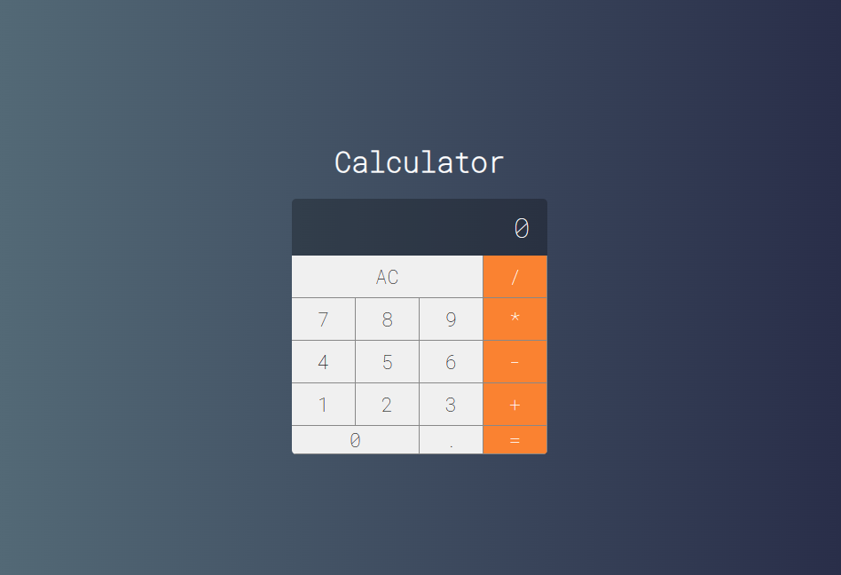

<h1 align="center">
    VUE Calculator
</h1>


<nav>
  <ul style="list-style:none;display:flex;justify-content:center;gap:40px;">
    <li>
      <a href="#projeto">Projeto</a>
    </li>
    <li>
      <a href="#configuracoes">Configurações</a>
    </li>
    <li>
      <a href="#tecnologias">Tecnologias</a>
    </li>
  </ul>
</nav>

<h2 id="projeto">
💻 Projeto
</h2>

O projeto é um clone da Calculadora do Mac, onde podemos efetuar todas as operações aritméticas básicas, como adição, subtração, divisão e multiplicação.


<h2 id="configuracoes">
⚙ Configurações
</h2>
Antes de continuarmos, após clonar o projeto, você pode acessar a pasta via linha de comandos e utilizar os seguintes comandos para rodar o projeto: 

### Acesse a pasta do projeto
```sh
cd {nome da pasta}
```

### Instale as Dependências
```sh
npm install
```

### Compilação e Ativação do Auto-Reload para Desenvolvimento

```sh
npm run dev
```

### Compilação e Minificação para Produção

```sh
npm run build
```

### Lint com [ESLint](https://eslint.org/)

```sh
npm run lint
```


<h2 id="tecnologias">
🚀 Tecnologias
</h2>

Esse projeto foi desenvolvido com as seguintes tecnologias:

- [HTML5](https://developer.mozilla.org/en-US/docs/Web/HTML)
- [CSS](https://developer.mozilla.org/pt-BR/docs/Learn/Getting_started_with_the_web/CSS_basics)
- [JavaScript](https://developer.mozilla.org/en-US/docs/Web/JavaScript)
- [Vue](https://vuejs.org/)